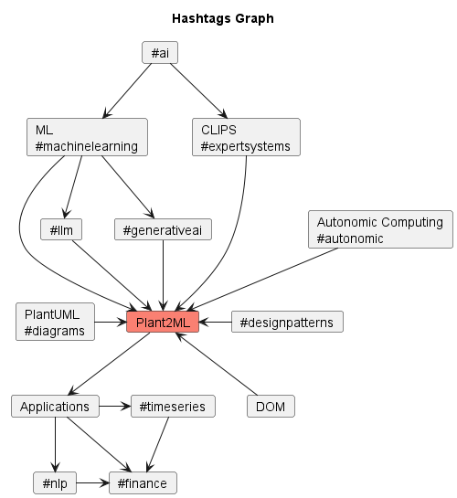

# 🏭 Plant2ML Weekly Highlights

Explore our weekly top highlights in #machinelearning, featuring PlantUML-powered #diagrams. We ❤️ reading and discussing scientific papers, especially at the intersection of: #llm, #expertsystems, #automl and #autonomic computing with applications in #timeseries and #nlp.

<!--
[Subscribe to our newsletter](https://nlpnews.substack.com/) to get a weekly list of top ML papers in your inbox.
-->
Here is the weekly series:

## 2024
- [Top References of the Week (June 10 - June 16)](./#top-references-of-the-week-june-10---june-16---2024)
- [Top References of the Week (June 3 - June 9)](./#top-references-of-the-week-june-3---june-9---2024)
- [Top References of the Week (May 27 - June 2)](./#top-references-of-the-week-may-27---june-2---2024)
- [Top References of the Week (May 20 - May 26)](./#top-references-of-the-week-may-20---may-26---2024)
- [Top References of the Week (May 13 - May 19)](./#top-references-of-the-week-may-13---may-19---2024)
- [Top References of the Week (May 6 - May 12)](./#top-references-of-the-week-may-6---may-12---2024)
- [Top References of the Week (April 29 - May 5)](./#top-references-of-the-week-april-29---may-5---2024)
- [Top References of the Week (April 22 - April 28)](./#top-references-of-the-week-april-22---april-28---2024)
- [Top References of the Week (April 15 - April 21)](./#top-references-of-the-week-april-15---april-21---2024)
- [Top References of the Week (April 8 - April 14)](./#top-references-of-the-week-april-8---april-14---2024)
- [Top References of the Week (April 1 - April 7)](./#top-references-of-the-week-april-1---april-7---2024)
- [Top References of the Week (March 25 - March 31)](./#top-references-of-the-week-march-25---march-31---2024)
- [Top References of the Week (March 18 - March 24)](./#top-references-of-the-week-march-18---march-24---2024)
- [Top References of the Week (March 11 - March 17)](./#top-references-of-the-week-march-11---march-17---2024)
- [Top References of the Week (March 4 - March 10)](./#top-references-of-the-week-march-4---march-10---2024)
- [Top References of the Week (February 26 - March 3)](./#top-references-of-the-week-february-26---march-3---2024)
- [Top References of the Week (February 19 - February 25)](./#top-references-of-the-week-february-19---february-25---2024)

Follow us on [Twitter](https://twitter.com/mobilepixel) and [GitHub](https://github.com/mirceat/Plant2ML-Weekly).

<!--
[Join our Discord](https://discord.gg/SKgkVT8BGJ)
-->

## Top References of the Week (June 10 - June 16) - 2024
| **Reference**                                                                                                                            | **Hashtag**      | **Links**                                                                                                                                         |
|------------------------------------------------------------------------------------------------------------------------------------------|------------------|---------------------------------------------------------------------------------------------------------------------------------------------------|
| 1) **Cao 2024** - Recent advances in **text embedding**: A Comprehensive Review of Top-Performing Methods on the MTEB Benchmark (survey) | #llm #embeddings | [Paper](https://arxiv.org/pdf/2406.01607)
| 2) **Acher 2023** - Generative AI for Reengineering Variants into **Software Product Lines**: An Experience Report | #llm | [Paper](https://dl.acm.org/doi/abs/10.1145/3579028.3609016) [GitHub](https://github.com/acherm/variantsGPT/)
| 3) **Zhou 2024 - A Survey on Efficient Inference for Large Language Models** | #llm | [Paper](https://arxiv.org/pdf/2404.14294)

## Top References of the Week (June 3 - June 9) - 2024
| **Reference**                                                                                   | **Hashtag**   | **Links**                                                                                                                                         |
|-------------------------------------------------------------------------------------------------|---------------|---------------------------------------------------------------------------------------------------------------------------------------------------|
| 1) Training and Finetuning Embedding Models with **Sentence Transformers** v3                   | #embeddings | [Blog](https://huggingface.co/blog/train-sentence-transformers) [GitHub](https://sbert.net/)
| 2) **Named Entity Recognition** Using ChatGPT                                                   | #nlp          | [Blog](https://datasciencenerd.us/named-entity-recognition-using-chatgpt-9d48b2a19103)
| 3) **Harel 2012** - Behavioral Programming                                                      | #fsm #toread  | [Paper](https://www.wisdom.weizmann.ac.il/~amarron/BP%20-%20CACM%20-%20Author%20version.pdf)
| 4) **Yaacov 2023** - BPpy: Behavioral programming in Python                                     | #fsm #python #toread | [Paper](https://www.sciencedirect.com/science/article/pii/S2352711023002522) [GitHub](https://github.com/bThink-BGU/BPPy) 
| 5) ACM - Understanding the **LLM Development Cycle**: Building, Training, and Finetuning        | #llm #webinar | [Webinar](https://events.zoom.us/ejl/ArzwACAJCGWLB-pPrWeIwszDr8WDhlEcFLL4VMCb1SJVU4fzrQo9~A9mb_Le_JPLEruxl-lwMjbZf6lXrtE2-2-qWCvQsy1MTDMZ4Cy-e5snIW-lj9Z-013f-9UZXV6RFTizdjcvx-dlR8g6PLPiaWaeyx/home) [Slides](https://sebastianraschka.com/pdf/slides/2024-acm.pdf)
| 6) **Benveniste 2024** - Implementing the **Self-Attention** Mechanism from Scratch in PyTorch! | | [Blog](https://www.linkedin.com/pulse/implementing-self-attention-mechanism-from-scratch-damien-benveniste-tahjc/) [YouTube1](https://www.youtube.com/watch?v=W28LfOld44Y) [YouTube2](https://www.youtube.com/watch?v=ZPLym9rJtM8&t=19s)
| 7) Visualizing The **Training Costs** Of AI Models Over Time                                    | | [Blog](https://www.zerohedge.com/technology/visualizing-training-costs-ai-models-over-time)
| 8) **Google Mesop** - Build delightful web apps quickly in Python                               | #uiux | [GitHub](https://github.com/google/mesop) [Website](https://google.github.io/mesop/) [Tweet](https://x.com/rohanpaul_ai/status/1798457077037469962)
| 9) **Yang 2024 - Buffer of Thoughts**: Thought-Augmented Reasoning with Large Language Models | #llm #reasoning | [YouTube](https://www.youtube.com/watch?v=gCGck5Fn3G4) [Paper](https://arxiv.org/pdf/2406.04271) [GitHub](https://github.com/YangLing0818/buffer-of-thought-llm) [Tweet](https://x.com/omarsar0/status/1799113545696567416)
| 10) Understanding **ChatGPT Functions** and How to Use Them | #llm | [Blog](https://medium.com/@lucgagan/understanding-chatgpt-functions-and-how-to-use-them-6643a7d3c01a)

## Top References of the Week (May 27 - June 2) - 2024
| **Reference**                                                                                                                                                                                                                                                                                                                            | **Hashtag**                 | **Links**                                                                                                                                         |
|------------------------------------------------------------------------------------------------------------------------------------------------------------------------------------------------------------------------------------------------------------------------------------------------------------------------------------------|-----------------------------|---------------------------------------------------------------------------------------------------------------------------------------------------|
| 1) **Qian 2024** - Are Long-LLMs A Necessity For Long-Context Tasks? **LC-Boost** reduces energy consumption significantly while maintaining performance.                                                                                                                                                                                | #llm                        | [Tweet](https://twitter.com/omarsar0/status/1795188655243264299) [Paper](https://arxiv.org/pdf/2405.15318v1)
| 2) **Li 2024** - **More Agents Is All You Need**. Increasing the number of instantiated large language model (LLM) agents using a sampling-and-voting method improves performance across various tasks, and this improvement scales with the complexity of the task, offering an orthogonal approach to existing enhancement techniques. | #llm                        | [Paper](https://arxiv.org/pdf/2402.05120) [Tweet](https://twitter.com/rohanpaul_ai/status/1795500059825463569) [GitHub](https://anonymous.4open.science/r/more_agent_is_all_you_need/README.md)
| 3) **Edge 399** - Understanding **External-Aid Planning and Autonomous Agents** How do we supply an agents with external help to improve its planning capabilities?                                                                                                                                                                      | #llm                        | [Blog](https://thesequence.substack.com/p/edge-399-understanding-external-aid) [GitHub](https://github.com/langroid/langroid)
| 4) **Hirsch 2024** - What's the Plan? Evaluating and Developing Planning-Aware Techniques for Language Models                                                                                                                                                                                                                            | #llm                        | [Paper](https://arxiv.org/abs/2402.11489)
| 5) **Niemueller 2018** - CLIPS-based Execution for PDDL Planners                                                                                                                                                                                                                                                                         |                             | [Paper](https://kbsg.rwth-aachen.de/~hofmann/papers/clips-exec-pddl.pdf)
| 6) **Xu 2024** - Faithful Logical Reasoning via Symbolic Chain-of-Thought                                                                                                                                                                                                                                                                | #llm #reasoning #toread     | [Paper](https://arxiv.org/abs/2405.18357) [YouTube](https://www.youtube.com/watch?v=BBhLELGj77k&t=1046s) [Tweet](https://twitter.com/omarsar0/status/1795925943543898157)
| 7) **Kafritsas 2023** - **AutoGluon-TimeSeries** : Creating Powerful Ensemble Forecasts - Complete Tutorial                                                                                                                                                                                                                              | #automl #timeseries #toread | [Blog](https://aihorizonforecast.substack.com/p/autogluon-timeseries-creating-powerful)
| 8) **Wang 2024** - **Executable Code Actions** Elicit Better LLM Agents                                                                                                                                                                                                                                                                  | #llm #python                | [Paper](https://huggingface.co/papers/2402.01030) [Tweet](https://twitter.com/_philschmid/status/1795853856628199619) [GitHub](https://github.com/xingyaoww/code-act) [Website](https://chat.xwang.dev/conversation/Vqn108G)
| 9) Few-shot tool-use doesn’t really work (yet)                                                                                                                                                                                                                                                                                           | #llm                        | [Blog](https://research.google/blog/few-shot-tool-use-doesnt-really-work-yet/)
| 10) **Jacovi 2023** - A Comprehensive Evaluation of Tool-Assisted Generation Strategies                                                                                                                                                                                                                                                  | #llm                        | [Paper](https://aclanthology.org/2023.findings-emnlp.926/)

## Top References of the Week (May 20 - May 26) - 2024
| **Reference**                                                                                                                                | **Hashtag**               | **Links**                                                                                                                                         |
|----------------------------------------------------------------------------------------------------------------------------------------------|---------------------------|---------------------------------------------------------------------------------------------------------------------------------------------------|
| 1) **Nguyen 2015** - A Self-Healing Framework for Online Sensor Data                                                                         | #autonomic | [Paper](https://www.researchgate.net/publication/278786537_A_Self-Healing_Framework_for_Online_Sensor_Data)
| 2) **Kephart 2004** - An artificial intelligence perspective on autonomic computing policies                                                 | #autonomic #toread | [Paper](https://ieeexplore.ieee.org/document/1309145)
| 3) Today’s AI models are impressive. **Teams** of them will be formidable                                                                    | #llm | [TheEconomist](https://www.economist.com/science-and-technology/2024/05/13/todays-ai-models-are-impressive-teams-of-them-will-be-formidable)
| 4) **Prompt Like a Data Scientist**: Auto Prompt Optimization and Testing with DSPy Applying machine learning methodology to prompt building | #llm | [Blog](https://towardsdatascience.com/prompt-like-a-data-scientist-auto-prompt-optimization-and-testing-with-dspy-ff699f030cb7) [GitHub](https://github.com/yip-kl/llm_dspy_tutorial)
| 5) Build Autonomous AI Agents with **Function Calling**. Transform your chatbot into an agent that can interact with external APIs | #llm | [Blog](https://towardsdatascience.com/build-autonomous-ai-agents-with-function-calling-0bb483753975)
| 6) How Artificial Intelligence is Powering the Next Wave of **Autonomic Computing** | #autonomic | [Blog](https://www.linkedin.com/pulse/how-artificial-intelligence-powering-next-wave-giovanni-sisinna/)
| 7) **ryjo.codes** - Tour of CLIPS | #expertsystems | [Website](https://ryjo.codes/tour-of-clips.html)
| 8) **Lencses 2024** - Combining Textual and Graphical Modeling with Next Generation Frameworks | #thesis #diagrams #toread | [Thesis](https://repositum.tuwien.at/bitstream/20.500.12708/197412/1/Lencses%20Adam%20-%202024%20-%20Combining%20Textual%20and%20Graphical%20Modeling%20with%20Next...pdf) [Langium](https://langium.org/) [GLSP](https://eclipse.dev/glsp/)  
| 9) **Prompt Engineering Guide** | #llm #toread | [Website](https://www.promptingguide.ai/)
| 10) I Wrote an **Intelligent Editor** to Supercharge the Process of Writing Articles. | #llm | [Blog](https://medium.com/@rahul.nyk/i-wrote-an-intelligent-editor-to-supercharge-the-process-of-writing-articles-84a4d92a7e9f)

## Top References of the Week (May 13 - May 19) - 2024
| **Reference**                                                                                                                                                                                                      | **Hashtag**               | **Links**                                                                                                                                         |
|--------------------------------------------------------------------------------------------------------------------------------------------------------------------------------------------------------------------|---------------------------|---------------------------------------------------------------------------------------------------------------------------------------------------|
| 1) The Decoder - Magnific AI co-founder predicts the rise of **"one-person unicorns"** propelled by AI after exit                                                                                                  | #llm                      | [Blog](https://the-decoder.com/magnific-ai-co-founder-predicts-the-rise-of-one-person-unicorns-propelled-by-ai-after-exit/) [Website](https://magnific.ai/)
| 2) IBM - An architectural blueprint for **autonomic computing**.                                                                                                                                                   | #autonomic                | [Whitepaper](https://citeseerx.ist.psu.edu/document?repid=rep1&type=pdf&doi=0e99837d9b1e70bb35d516e32ecfc345cd30e795)
| 3) **Pang 2024 - AI2Apps**: A Visual IDE for Building LLM-based AI Agent Applications                                                                                                                              | #llm #etl #diagrams #uiux | [Paper](https://arxiv.org/abs/2404.04902) [YouTube](https://www.youtube.com/watch?v=tQTqxk1LzzU) [Website](https://www.ai2apps.com//-homekit/home.html) [GitHub](https://github.com/Avdpro/ai2apps)
| 4) Model Explorer: **Graph visualization** for large model development                                                                                                                                             | #diagrams #etl            | [Blog](https://research.google/blog/model-explorer/)
| 5) 8 Google Employees Invented Modern AI. Here’s the Inside Story They met by chance, got hooked on an idea, and wrote the “**Transformers**” paper—the most consequential tech breakthrough in recent history.    | #llm                      | [Wired](https://www.wired.com/story/eight-google-employees-invented-modern-ai-transformers-paper/)
| 6) Scalable **Graph Reasoning with LLMs**                                                                                                                                                                          | #llm                      | [Blog](https://medium.com/codex/reasoning-on-graphs-with-llms-805751ab5bd1)
| 7) **Large Language Model Performance in Time Series Analysis** - How do major LLMs stack up at detecting anomalies or movements in the data when given a large set of time series data within the context window? | #llm #timeseries          | [Blog](https://towardsdatascience.com/large-language-model-performance-in-time-series-analysis-4d274b480e24) [GitHub](https://github.com/Arize-ai/LLMTest_NeedleInAHaystack/tree/main)
| 8) **Infinite Wonderland** - This is an AI experiment where the timeless classic Alice’s Adventures in Wonderland is endlessly reimagined by artists, AI and you. Google                                           | #uiux                     | [Website](https://infinitewonderland.withgoogle.com/) [YouTube](https://www.youtube.com/watch?v=oP1rIPkJte0) 
| 9) Models Are Converging Towards the **Same Representation of the World**                                                                                                                                          | #llm                      | [Blog](https://alphasignal.activehosted.com/social/757b505cfd34c64c85ca5b5690ee5293.198)
| 10) **Huh 2024** - The **Platonic Representation** Hypothesis                                                                                                                                                      | #llm #toread              | [Paper](https://arxiv.org/abs/2405.07987)

## Top References of the Week (May 6 - May 12) - 2024
| **Reference**                                                                                                                                                                                                     | **Hashtag**      | **Links**                                                                                                                                         |
|-------------------------------------------------------------------------------------------------------------------------------------------------------------------------------------------------------------------|------------------|---------------------------------------------------------------------------------------------------------------------------------------------------|
| 1) **Wu 2024** - A Model Transformation Method Based on Simulink/Stateflow for Validation of UML Statechart Diagram                                                                                               | #fsm #toread     | [Paper](https://www.researchsquare.com/article/rs-3863475/v1)
| 2) **DRAKON** is a visual language from the aerospace industry for representing algorithms, processes, and procedures. The goal of DRAKON is to make procedures easy to comprehend.                               | #diagrams        | [Website](https://drakonhub.com/) [YouTube](https://www.youtube.com/watch?v=CIohJn7fAhU)
| 3) **Wu 2023** - A brief overview of ChatGPT: The history, status quo and potential future development                                                                                                            | #llm #toread     | [Paper](https://ieeexplore.ieee.org/abstract/document/10113601)
| 4) Large Language Model Performance in **Time Series Analysis**. How do major LLMs stack up at detecting anomalies or movements in the data when given a large set of time series data within the context window? | #llm #timeseries | [Blog](https://towardsdatascience.com/large-language-model-performance-in-time-series-analysis-4d274b480e24)
| 5) You’re Not Unlocking **ChatGPT**’s Full Potential. Here’s How to Do It. How to make the most of your ChatGPT subscription.                                                                                     | #llm             | [Blog](https://artificialcorner.com/p/youre-not-unlocking-chatgpts-full) [YouTube](https://www.youtube.com/watch?v=NW7Ho6IqZIo)
| 6) Massive prompts can outperform fine-tuning for LLMs, researchers find. **Bertsch 2024 - In-Context Learning** with Long-Context Models: An In-Depth Exploration                                                | #llm #toread     | [Blog](https://the-decoder.com/massive-prompts-outperform-fine-tuning-for-llms-in-new-study-researchers-find/) [Paper](https://arxiv.org/abs/2405.00200) 
| 7) Meaningless fillers enable complex thinking in large language models. **Pfau 2024 - Let’s Think Dot by Dot**: Hidden Computation in Transformer Language Models                                                | #llm #toread     | [Blog](https://the-decoder.com/meaningless-fillers-enable-complex-thinking-in-large-language-models/) [Paper](https://arxiv.org/pdf/2404.15758)
| 8) Hundreds of examples in prompts can significantly boost LLM performance, study finds. **Agarwal 2024 - Many-Shot In-Context Learning**                                                                         | #llm #toread     | [Blog](https://the-decoder.com/hundreds-of-examples-in-prompts-can-significantly-boost-llm-performance-study-finds/) [Paper](https://arxiv.org/pdf/2404.11018)
| 9) AI fact-checking is more accurate and 20 times cheaper than human effort, study finds. **Wei 2024 - LONG-FORM FACTUALITY** IN LARGE LANGUAGE MODELS                                                            | #llm #toread     | [Blog](https://the-decoder.com/large-language-models-with-google-access-outperform-humans-in-factual-accuracy-study-finds/) [Paper](https://arxiv.org/pdf/2403.18802) [GitHub](https://github.com/google-deepmind/long-form-factuality)  
| 10) Secret Service gets its own **private GPT-4 model** that operates completely offline | #llm | [Blog](https://the-decoder.com/secret-service-gets-its-own-private-gpt-4-model-that-operates-completely-offline/)                                                                                                                         

## Top References of the Week (April 29 - May 5) - 2024
| **Reference**                                                                                                                   | **Hashtag** | **Links**                                                                                                                                         |
|---------------------------------------------------------------------------------------------------------------------------------|------|---------------------------------------------------------------------------------------------------------------------------------------------------|
| 1) **Netz 2024** - From Natural Language to Web Applications: Using Large Language Models for Model-Driven Software Engineering | #llm #uiux #toread | [Paper](https://dl.gi.de/server/api/core/bitstreams/9b054ac7-5872-4c7d-9cb9-49eba42887cb/content)
| 2) **AutoML for time series**: definitely a good idea                                                                           | #timeseries #automl #toread | [Blog](https://towardsdatascience.com/automl-for-time-series-definitely-a-good-idea-c51d39b2b3f)
| 3) **Chat With Your Documents** Using Langchain and Streamlit                                                                   | #llm | [Blog](https://fsndzomga.medium.com/build-a-chat-with-csv-app-using-langchain-and-streamlit-94a8b3363aa9)
| 4) **Conrardy 2024** - From Image to UML: First Results of **Image Based UML Diagram Generation** Using LLMs - BESSER           | #llm #diagrams | [Paper](https://arxiv.org/abs/2404.11376) [GitHub1](https://besser.readthedocs.io/en/latest/) [GitHub2](https://github.com/BESSER-PEARL/BESSER) [GitHub3](https://github.com/BESSER-PEARL/BESSER-examples) [GitHub4](https://github.com/BESSER-PEARL/IMG2UML-Examples) 
| 5) **Cámara 2023** - On the assessment of **generative AI in modeling tasks**: an experiencereport with ChatGPT and UML         | #llm | [Paper](https://www.researchgate.net/publication/370948184_On_the_assessment_of_generative_AI_in_modeling_tasks_an_experience_report_with_ChatGPT_and_UML)
| 6) **Venkatesan 2023** - ConStaBL - A Fresh Look at Software Engineering with **State Machines**                                | #fsm | [Paper](https://arxiv.org/abs/2307.03790)
| 7) **Ashrov 2023** - Enhancing Deep Learning with Scenario-Based Override Rules: a Case Study                                   | #fsm | [Paper](https://arxiv.org/abs/2301.08114)
| 8) **Koziolek 2024** - LLM-based and Retrieval-Augmented Control Code Generation                                                | #llm | [Paper](https://llm4code.github.io/assets/pdf/papers/39.pdf) [GitHub](https://github.com/hkoziolek/LLM-CodeGen-RAG/tree/main)
| 9) **Yerushalmi 2023** - Enhancing Deep Reinforcement Learning with Executable Specifications                                   | #toread | [Paper](https://dl.acm.org/doi/pdf/10.1109/ICSE-Companion58688.2023.00058)
| 10) **Yerushalmi 2023** - Enhancing Deep Reinforcement Learning with Scenario-Based Modeling                                    | #toread | [Paper](https://www.researchgate.net/publication/367050262_Enhancing_Deep_Reinforcement_Learning_with_Scenario-Based_Modeling)

## Top References of the Week (April 22 - April 28) - 2024
| **Reference**                                                                    | **Hashtag**                  | **Links**                                                                                                                                         |
|----------------------------------------------------------------------------------|------------------------------|---------------------------------------------------------------------------------------------------------------------------------------------------|
| 1) Case Study on **M5 Forecasting** - Accuracy Kaggle Competition                | #dataset #timeseries #toread | [Blog](https://medium.com/analytics-vidhya/case-study-on-m5-forecasting-accuracy-kaggle-competition-893d7e124b54) [GitHub](https://github.com/aakashveera/M5-Accuracy/blob/master/Notebook%20M5%20Accuracy.ipynb) [Kaggle](https://www.kaggle.com/competitions/m5-forecasting-accuracy/data) 
| 2) What is **transformer architecture** and how does it power ChatGPT?           | #llm #transformer #toread    | [Blog](https://www.thoughtspot.com/data-trends/ai/what-is-transformer-architecture-chatgpt)
| 3) New Breakthroughs in **Text Embedding**                                       | #embeddings #nlp #toread     | [Blog](https://angelina-yang.medium.com/new-breakthroughs-in-text-embedding-13d0e93ee44f)
| 4) **OpenAI** - GPT-4 Technical Report (100 pages)                               | #llm #toread                 | [Paper](https://arxiv.org/abs/2303.08774)
| 5) **Simple Moving Average (SMA)** Explained: What Is It and Why Does It Matter? | #finance                     | [Blog](https://surgetrader.com/simple-moving-average-sma-explained-what-is-it-and-why-does-it-matter)
| 6) **Replit** - Building LLMs for Code Repair                                    | #llm #ot #toread             | [Blog](https://blog.replit.com/code-repair) [YouTube](https://www.youtube.com/watch?v=NrVxxtZAX08)
| 7) LangGraph + Function Call+ YahooFinance = **AI Trading Chatbot** | #finance #toread | [Blog](https://levelup.gitconnected.com/langgraph-function-call-yahoofinance-ai-trading-chatbot-b830e60c0c0a)
| 8) **Zhou 2024 - SELF-DISCOVER**: Large Language Models Self-Compose Reasoning Structures | #llm #reasoning #toread | [Paper](https://arxiv.org/abs/2402.03620)
| 9) **Operational Transformations** - as an algorithm for automatic conflict resolution | #ot #toread | [Blog](https://medium.com/coinmonks/operational-transformations-as-an-algorithm-for-automatic-conflict-resolution-3bf8920ea447)
| 10) **Zhao 2023** - A Survey of **Large Language Models** | #llm #toread | [Paper](https://arxiv.org/abs/2303.18223)

## Top References of the Week (April 15 - April 21) - 2024
| **Reference**                                                                                                                                                                                                                                                                                      | **Hashtag**                   | **Links**                                                                                                                                         |
|----------------------------------------------------------------------------------------------------------------------------------------------------------------------------------------------------------------------------------------------------------------------------------------------------|-------------------------------|---------------------------------------------------------------------------------------------------------------------------------------------------|
| 1) **Edge 375**: - Explores the fairly new **System 2 Attention(S2A)** method for LLM reasoning. It reviews Meta AI original S2A paper and the LLMFlows framework. **Chainlit** by Literal AI.                                                                                                     | #llm #reasoning               | [Blog](https://thesequence.substack.com/p/edge-375-metas-system-2-attention) [GitHub](https://github.com/Chainlit/chainlit)                       
| 2) **Weston 2023**: - System 2 Attention (is something you might need too)                                                                                                                                                                                                                         | #llm #reasoning               | [Paper](https://arxiv.org/abs/2311.11829)                                                                                                         
| 3) TheSequence - **Neuro-Symbolic Models** are Making a Comeback. A new startup called **Symbolica** comes out of stealth with a very different value proposition. Symbolica uses mathematical techniques such as category theory to build simpler models that are easier to manage and interpret. | #llm #reasoning               | [Blog](https://thesequence.substack.com/p/neuro-symbolic-models-are-making)                                                                       
| 4) **Ferrando 2024** - A Primer on the Inner Workings of Transformer-based Language Models                                                                                                                                                                                                         | #transformers #toread         | [Tweet](https://twitter.com/omarsar0/status/1786052338043466162)                                                                                  
| 5) **Tao 2024** - A Survey on **Self-Evolution** of Large Language Models                                                                                                                                                                                                                          | #llm #toread                  | [Paper](https://arxiv.org/abs/2404.14387) [Tweet](https://twitter.com/omarsar0/status/1782777977526231440)                                        
| 6) **Fan 2024** - Graph Machine Learning in the Era of Large Language Models (LLMs) | #llm #toread                  | [Paper](https://arxiv.org/abs/2404.14928) [Tweet](https://twitter.com/omarsar0/status/1783171591020392886)                                        
| 7) **Cotteret 2024** - Vector Symbolic Finite State Machines in Attractor Neural Networks | #fsm #embeddings #toread      | [Paper](https://direct.mit.edu/neco/article/36/4/549/119784/Vector-Symbolic-Finite-State-Machines-in-Attractor)                                   
| 8) **DSPy**: - A Revolutionary Framework for Programming LLMs | #llm                          | [Blog](https://www.theaidream.com/post/dspy-a-revolutionary-framework-for-programming-llms#:~:text=DSPy%2C%20short%20for%20%22Declarative%20Self) 
| 9) **Makridakis 2023**: - The M6 forecasting competition: Bridging the gap between forecasting and investment decisions | #dataset #timeseries #toread | [Paper](https://arxiv.org/abs/2310.13357)                                                                                                                                          | 
| 10) What is **transformer** architecture and how does it power ChatGPT? | #transformer #llm #toread | [Blog](https://www.thoughtspot.com/data-trends/ai/what-is-transformer-architecture-chatgpt)

## Top References of the Week (April 8 - April 14) - 2024
| **Reference**                                                                                                                                                                                                                                                     | **Hashtag**                | **Links**                                                                                                                                                                                                                    |
|-------------------------------------------------------------------------------------------------------------------------------------------------------------------------------------------------------------------------------------------------------------------|----------------------------|------------------------------------------------------------------------------------------------------------------------------------------------------------------------------------------------------------------------------|
| 1) **Côté 2019: - TextWorld**: A Learning Environment for Text-based Games                                                                                                                                                                                        |                            | [Paper](https://arxiv.org/abs/1806.11532)
| 2) **Ezenkwu 2023** - Towards Expert Systems for Improved Customer Services Using ChatGPT as an Inference Engine                                                                                                                                                  | #expertsystems #llm        | [Paper](https://ieeexplore-ieee-org.proxy.bib.uottawa.ca/abstract/document/10248647)
| 3) **Bhargva 2024** - What's the Magic Word? A Control Theory of LLM Prompting                                                                                                                                                                                    | #llm                       | [Tweet](https://twitter.com/ABhargava2000/status/1783318755956998219) [Paper](https://arxiv.org/abs/2310.04444) [YouTube](https://www.youtube.com/watch?v=9QtS9sVBFM0)
| 4) **Dias 2020** - Visual Self-healing Modelling for Reliable Internet-of-Things Systems (Node-RED)                                                                                                                                                               | #autonomic                 | [Paper](https://link-springer-com.proxy.bib.uottawa.ca/chapter/10.1007/978-3-030-50426-7_27) [GitHub](https://github.com/jpdias/node-red-contrib-self-healing) [Website](https://jpdias.me/node-red-contrib-self-healing/)
| 5) **Dias 2020** - A Pattern-Language for Self-Healing Internet-of-Things Systems                                                                                                                                                                                 | #autonomic #designpatterns | [Paper](https://dl.acm.org/doi/pdf/10.1145/3424771.3424804)
| 6) Edge 371: Two-Step LLM Reasoning with **Skeleton of Thoughts**. Created by Microsoft Research, the technique models some of the aspects of human cognitive reasoning in LLMs. **Dify** is an Open Source Platform for Streamlining the Development of LLM Apps | #llm #reasoning #etl       | [Blog](https://thesequence.substack.com/p/edge-371-two-step-llm-reasoning-with) [GitHub](https://github.com/langgenius/dify) 
| 7) **Ning 2024 - SKELETON-OF-THOUGHT**: PROMPTING LLMS FOR EFFICIENT PARALLEL GENERATION                                                                                                                                                                          | #llm #reasoning | [Paper](https://arxiv.org/abs/2307.15337) [Website](https://sites.google.com/view/sot-llm) [GitHub](https://github.com/imagination-research/sot)
| 8) Edge 373: Computationally Efficient LLM Reasoning with **ReWOO**. LLMFlows                                                                                                                                                                                     | #llm #reasoning | [Blog](https://thesequence.substack.com/p/edge-373-computationally-efficient) [GitHub](https://github.com/stoyan-stoyanov/llmflows) [Substack](https://llmflows.substack.com/p/build-your-own-agent-from-scratch)
| 9) **Xu 2023 - ReWOO**: Decoupling Reasoning from Observations for Efficient Augmented Language Models | #llm #reasoning | [Paper](https://arxiv.org/abs/2305.18323) [GitHub](https://github.com/billxbf/ReWOO)
| 10) **Arkoudas 2023** - GPT-4 Can't Reason | #llm #reasoning | [Paper](https://arxiv.org/abs/2308.03762v2)

## Top References of the Week (April 1 - April 7) - 2024
| **Reference**                                                                                                                                  | **Hashtag**          | **Links**                                                                                                                                                                                                                    |
|------------------------------------------------------------------------------------------------------------------------------------------------|----------------------|------------------------------------------------------------------------------------------------------------------------------------------------------------------------------------------------------------------------------|
| 1) **DSPy**: - Not Your Average Prompt Engineering                                                                                             | #llm                 | [Blog](https://jina.ai/news/dspy-not-your-average-prompt-engineering)                                                                                                                                                        
| 2) Edge 365: - Understanding LLM Reasoning with **Reflexion**                                                                                  | #llm #reasoning      | [Blog](https://thesequence.substack.com/p/edge-365-understanding-llm-reasoning) [GitHub](https://github.com/FlowiseAI/Flowise) [Flowiseai](https://flowiseai.com/)                                                           
| 3) **Shinn 2023 - Reflexion**: Language Agents with Verbal Reinforcement Learning                                                              | #llm #reasoning      | [Paper](https://arxiv.org/abs/2303.11366) [GitHub](https://github.com/noahshinn/reflexion)                                                                                                                                   
| 4) Edge 367: - Understanding **Multi-Chain Reasoning** in LLMs One of the most interesting techniques used for more complex reasoning in LLMs. | #llm #reasoning      | [Blog](https://thesequence.substack.com/p/edge-367-understanding-multi-chain)                                                                                                                                                
| 5) Yoran 2023 - Answering Questions by Meta-Reasoning over **Multiple Chains of Thought**                                                      | #llm #reasoning      | [Paper](https://arxiv.org/abs/2304.13007) [GitHub](https://github.com/oriyor/reasoning-on-cots)                                                                                                                              
| 6) Edge 369: - LLM Reasoning with **Chain-Of-Code** Can LLMs use code generation to reason through complex tasks?                              | #llm #reasoning      | [Blog](https://thesequence.substack.com/p/edge-369-llm-reasoning-with-chain) [Helicone](https://www.helicone.ai/) [GitHub](https://github.com/Helicone/helicone)                                                             
| 7) Li 2023 - **Chain of Code**: Reasoning with a Language Model-Augmented Code Emulator                                                        | #llm #reasoning      | [Website](https://chain-of-code.github.io/) [Paper](https://chain-of-code.github.io/paper.pdf) [Colab](https://colab.research.google.com/github/google-research/google-research/blob/master/code_as_policies/coc_demo.ipynb) 
| 8) **Generative AI** - Design Patterns.                                                                                                        | #llm #designpatterns | [Website](https://htmlpreview.github.io/?https://github.com/lakshmanok/generative-ai-design-patterns/blob/main/catalog.html)                                                                                                 
| 9) **replit** - Building LLMs for Code Repair. Replit represents code as a sequence of **Operational Transformations (OTs)**.                  | #llm                 | [Blog](https://blog.replit.com/code-repair)                                                                                                                                                                                  
| 10) **Shchur 2023 - AutoGluon–TimeSeries**: AutoML for Probabilistic Time Series Forecasting | #automl #timeseries | [Website](https://openreview.net/forum?id=XHIY3cQ8Tew) [Paper](https://openreview.net/pdf?id=XHIY3cQ8Tew) [YouTube](https://www.youtube.com/watch?v=niLmfjXeHnE)                                                                                                        |

## Top References of the Week (March 25 - March 31) - 2024
| **Reference**                                                                                                                                                            | **Hashtag**     | **Links** |
|--------------------------------------------------------------------------------------------------------------------------------------------------------------------------|-----------------|-----------|
| 1) Creating large-scale **ShareDB** + React + Redux application                                                                                                          |                 | [Blog](https://medium.com/@jaceksroga/creating-large-scale-sharedb-react-redux-application-cd7924a89ad)
| 2) Real-Time Collaboration Made Simple: **ShareDB** and JavaScript Unveiled Elevate Your Collaboration Game with Seamless Real-Time Editing Using ShareDB and JavaScript |                 | [Blog](https://mysteryweevil.medium.com/real-time-collaboration-made-simple-sharedb-and-javascript-unveiled-55c1730d0550)
| 3) Edge 357: - Understanding **Chain-of-Thought Prompting** A deep dive into the most popular LLM reasoning technique                                                    | #llm #reasoning | [Blog](https://thesequence.substack.com/p/edge-357-understanding-chain-of-thought) [GitHub](https://github.com/jina-ai/thinkgpt).
| 4) **Wei 2023 - Chain-of-Thought Prompting** Elicits Reasoning in Large Language Models                                                                                  | #llm #reasoning | [Paper](https://arxiv.org/abs/2201.11903)
| 5) **Edge 359**: - Understanding **Tree-Of-Thoughts** in LLM Reasoning A variation of chain-of-thought for evaluating different reasoning paths.                         | #llm #reasoning | [Blog](https://thesequence.substack.com/p/edge-359-understanding-tree-of-thoughts) [GitHub](https://github.com/EleutherAI/lm-evaluation-harness)
| 6) **Yao 2023** - **Tree of Thoughts**: Deliberate Problem Solving with Large Language Models                                                                            | #llm #reasoning | [Paper](https://arxiv.org/abs/2305.10601) [GitHub](https://github.com/princeton-nlp/tree-of-thought-llm)
| 7) “Find the Difference” in Python **Difflib** — A hidden gem in Python built-in libraries                                                                               | #python | [Blog](https://towardsdatascience.com/find-the-difference-in-python-68bbd000e513)
| 8) Edge 361: - LLM Reasoning with **Graph of Thoughts** Not chains or trees but graph structures for LLM reasoning.                                                      | #llm #reasoning | [Blog](https://thesequence.substack.com/p/edge-361-llm-reasoning-with-graph) [LangSmith](https://www.langchain.com/langsmith)
| 9) **Besta 2023 - Graph of Thoughts**: Solving Elaborate Problems with Large Language Models | #llm #reasoning | [Paper](https://arxiv.org/abs/2308.09687) [GitHub](https://github.com/spcl/graph-of-thoughts)                                                                                             
| 10) Edge 363: **ReAct** - Inside Google's Reasoning+Acting Method One of the most complete for LLM reasoning and agents | #llm #reasoning | [Blog](https://thesequence.substack.com/p/edge-363-inside-googles-reasoningacting) [Helicone](https://www.helicone.ai/)

## Top References of the Week (March 18 - March 24) - 2024
| **Reference**                                                                                                                                                                                                                                                                                                                                                                                                                                                                                                          | **Hashtag**        | **Links** |
|------------------------------------------------------------------------------------------------------------------------------------------------------------------------------------------------------------------------------------------------------------------------------------------------------------------------------------------------------------------------------------------------------------------------------------------------------------------------------------------------------------------------|--------------------|-----------|
| 1) **Si 2024 - Design2Code**: How Far Are We From Automating Front-End Engineering?                                                                                                                                                                                                                                                                                                                                                                                                                                    | #llm #uiux         | [Paper](https://arxiv.org/pdf/2403.03163.pdf) |
| 2) **Brockman 2023 - GPT-4 Developer Livestream**: developer demo showcasing GPT-4 and some of its capabilities/limitations.                                                                                                                                                                                                                                                                                                                                                                                           | #llm               | [YouTube](https://www.youtube.com/watch?v=outcGtbnMuQ)                                                               
| 3) **Senthil Sivakumar 2024** - Expert System for Smart Virtual **Facial Emotion Detection** Using Convolutional Neural Network. The paper introduces a technology-aided facial emotion detection system employing convolutional neural networks (CNN), enhancing virtual human detection and various fields by accurately capturing facial expressions, utilizing techniques like data augmentation, max pooling, batch normalization, and ResNet50 architecture, resulting in significantly higher accuracy and lower loss compared to existing models. |                    | [Paper](https://link-springer-com.proxy.bib.uottawa.ca/article/10.1007/s11277-024-10867-0)
| 4) **Nvidia 2024 AI Event** - Nvidia CEO Jensen Huang kicks off its GTC keynote in San Jose with a slew of AI infused chip announcements as well as the new NIM microservice.                                                                                                                                                                                                                                                                                                                                          |                    | [YouTube16min](https://www.youtube.com/watch?v=bMIRhOXAjYk) [YouTube2h](https://www.youtube.com/live/Y2F8yisiS6E?si=1RWu96-UCsaQdyIy&t=4566)
| 5) **Quantamagazine** - How Chain-of-Thought Reasoning Helps Neural Networks Compute. Large language models do better at solving problems when they show their work. Researchers are beginning to understand why.                                                                                                                                                                                                                                                                                                                                                                                                                                 | #llm #transformers | [Blog](https://www.quantamagazine.org/how-chain-of-thought-reasoning-helps-neural-networks-compute-20240321/?utm_source=Quanta+Magazine&utm_campaign=dab99cd006-RSS_Daily_Computer_Science&utm_medium=email&utm_term=0_f0cb61321c-dab99cd006-389736713&mc_cid=dab99cd006&mc_eid=94679035b5)
| 6) **Edge 353:** - A New Series About Reasoning in Foundation Models | #llm #reasoning    | [Blog](https://thesequence.substack.com/p/edge-353-a-new-series-about-reasoning)
| 7) **Bachtin 2022** - Human-level play in the game of Diplomacy by combining language models with strategic reasoning | #llm #reasoning    | [Paper](https://www.science.org/doi/10.1126/science.ade9097)
| 8) **Autonomic Computing** - An overview of Autonomic Computing | #autonomic         | [Slides](https://www.slideshare.net/PrithwishSarkar4/autonomic-computing-152721696)
| 9) **Edge 355:** - A Taxonomy to Understand LLM Reasoning Methods | #llm #reasoning    | [Blog](https://thesequence.substack.com/p/edge-355-a-taxonomy-to-understand) [GitHub](https://github.com/FranxYao/chain-of-thought-hub)
| 10) **Imani 2023** - MathPrompter: Mathematical Reasoning Using Large Language Models | #llm #reasoning    | [Paper](https://arxiv.org/abs/2303.05398)

## Top References of the Week (March 11 - March 17) - 2024
| **Reference**                                                                                                                                                                                                                                                                                                                                                           | **Hashtag** | **Links**                                                                                                                                                                                                                                                                          |
|-------------------------------------------------------------------------------------------------------------------------------------------------------------------------------------------------------------------------------------------------------------------------------------------------------------------------------------------------------------------------|-------------|------------------------------------------------------------------------------------------------------------------------------------------------------------------------------------------------------------------------------------------------------------------------------------|
| 1) **Xu 2024** - Knowledge Conflicts for LLMs: A Survey                                                                                                                                                                                                                                                                                                                 | #llm | [Paper](https://arxiv.org/abs/2403.08319) [Tweet](https://x.com/omarsar0/status/1768288774532858003?s=20)             |
| 2) **Programming Distributed Systems** - ACM's webinar on distributed systems describes MixT, a programming language that enables efficient, safe transactions across data of varying consistency levels, combining scalability with the performance benefits of weak consistency and the reliability of strong consistency. Presenter: Mae Milano - Princeton (1 hour) | #webinar    | [ACM](https://on.acm.org/t/programming-distributed-systems/3016) [Website](https://www.cs.princeton.edu/~mpmilano/)                                                                                                                                                                                                                   
| 3) **Weaviate Podcast #90! - Self-Discover** in DSPy with Chris Dossman (1 hour)                                                                                                                                                                                                                                                                                        | #llm        | [YouTube](https://www.youtube.com/watch?v=iC64q1gFWiY&t=59s) [Colab](https://colab.research.google.com/drive/1GkAQKmw1XQgg5UNzzy8OncRe79V6pADB?usp=sharing) [GitHub](https://github.com/weaviate/recipes/blob/main/integrations/you/Web-Research-Agent-with-Weaviate-and-You.ipynb) 
| 4) **Zhou 2024 - Self-Discover**: Large Language Models Self-Compose Reasoning Structures                                                                                                                                                                                                                                                                               | #llm        | [Paper](https://arxiv.org/abs/2402.03620)                                                                                                                                                                                                                                          
| 5) **Feldman 2023** - Trapping LLM “Hallucinations” Using Tagged Context Prompts                                                                                                                                                                                                                                                                                        | #llm        | [Paper](https://arxiv.org/pdf/2306.06085.pdf) [Blog](https://medium.com/ai-insights-cobet/trapping-hallucinations-in-ai-conversation-systems-using-context-prompts-f7f6b3303f1)                                                                                                    
| 6) **Luong 2024 - ReFT**: Reasoning with Reinforced Fine-Tuning                                                                                                                                                                                                                                                                                                         | #llm        | [Paper](https://arxiv.org/abs/2401.08967) [GitHub](https://github.com/lqtrung1998/mwp_ReFT)                                                                                                                                                                                        
| 7) **THESEQUENCE Edge 377** - LLM Reasoning with Reinforced Fine-Tuning. Uses "Reliable AI markup Language" (**RAIL** XML)                                                                                                                                                                                                                                              | #llm        | [Blog](https://thesequence.substack.com/p/edge-377-llm-reasoning-with-reinforced) [Website](https://www.guardrailsai.com/docs/guardrails_ai/getting_started#inspecting-step-1-getting-llm-output)                                                                                  
| 8) **Zhu 2024** - Knowledge-Augmented Planning for LLM Agents                                                                                                                                                                                                                                                                                                           | #llm        | [Paper](https://arxiv.org/abs/2403.03101)                                                                                                                                                                                                                                          
| 9) **LlamaParse** - Launching the first GenAI-native document parsing platform. Support for ~10 document types (.pdf, .pptx, .docx, .xml) and more. SOTA table/chart/image extraction                                                                                                                                                                                   | #llm #nlp | [Blog](https://www.llamaindex.ai/blog/launching-the-first-genai-native-document-parsing-platform) [GitHub](https://github.com/run-llama/llama_parse) [Tweet](https://x.com/jerryjliu0/status/1767988636702879911?s=20)
| 10) **Patel 2023** - Building Domain-Specific LLMs Faithful To The Islamic Worldview: Mirage or Technical Possibility? Suggests incorporating Guardrails AI's **RAILS** (Reliable AI markup Language) XML to prevent any malicious actity.                                                                                                                              | #llm | [Paper](https://arxiv.org/abs/2312.06652) [GitHub](https://github.com/shabazpatel/domain-specific-llm)

## Top References of the Week (March 4 - March 10) - 2024
| **Reference**                                                                                                                                                                                                            | **Hashtag**                | **Links**                                                                                                |
|--------------------------------------------------------------------------------------------------------------------------------------------------------------------------------------------------------------------------|----------------------------|----------------------------------------------------------------------------------------------------------|
| 1) **Transformers for Time-Series Data**                                                                                                                                                                                 | #timeseries #transformers | [Blog](https://medium.com/bearingpoint-data-analytics-ai/transformers-for-time-series-data-3fadff9f07d8) 
| 2) **Bentsen 2022** - Spatio-Temporal Wind Speed Forecasting using Graph Networks and Novel Transformer Architectures                                                                                                    | #timeseries #transformers | [Paper](https://arxiv.org/abs/2208.13585) [GitHub](https://github.com/LarsBentsen/FFTransformer.) 
| 3) **Bentsen 2023** - A Unified Graph Formulation for Spatio-Temporal Wind Forecasting                                                                                                                                   | #timeseries #transformers | [Paper](https://www.duo.uio.no/handle/10852/105903) 
| 4) **AutoML Time Series** - How to Forecast Time Series Data Using any Supervised Learning Model Featurizing time series data into a standard tabular format for classical ML models and improving accuracy using AutoML | #timeseries #automl | [Blog](https://towardsdatascience.com/how-to-forecast-time-series-data-using-any-supervised-learning-model-02dd62cd4bda) [GitHub](https://github.com/mturk24/blog_posts/blob/main/time_series_automl/time_series_automl.ipynb) [Kaggle](https://www.kaggle.com/datasets/robikscube/hourly-energy-consumption?select=PJME_hourly.csv)
| 5) **ReAct** - Using LangChain ReAct Agents for Answering Multi-hop Questions in RAG Systems. Useful when answering complex queries on internal documents in a step-by-step manner with ReAct and Open AI Tools agents.  | #llm | [Blog](https://towardsdatascience.com/using-langchain-react-agents-for-answering-multi-hop-questions-in-rag-systems-893208c1847e)
| 6) **Yao 2023** - REACT: SYNERGIZING REASONING AND ACTING IN LANGUAGE MODELS                                                                                                                                             | #llm | [Paper](https://arxiv.org/pdf/2210.03629.pdf) [GitHub](https://react-lm.github.io/) [Blog](https://blog.research.google/2022/11/react-synergizing-reasoning-and-acting.html)
| 7) **TradingGPT** - Discover TradingGPT: Multi-Agent System with Layered Memory and Distinct Characters                                                                                                                  | #finance #llm | [Blog](https://medium.com/@basics.machinelearning/discover-tradinggpt-multi-agent-system-with-layered-memory-and-distinct-characters-3070684812a8)
| 8) **Li 2023** - TradingGPT: Multi-Agent System with Layered Memory and Distinct Characters for Enhanced Financial Trading Performance                                                                                   | #finance #llm | [Paper](https://arxiv.org/pdf/2309.03736.pdf)
| 9) **ChatGPT Prompt Engineering for Developers** - from DeepLearning.AI by Andrew Ng and Isa Fulford (1 hour)                                                                                                            | #course #llm | [Course](https://www.deeplearning.ai/short-courses/chatgpt-prompt-engineering-for-developers/)
| 10) **Notebooks to Python** - Bridging the Gap: Converting Data Science Notebooks into Production ML Code                                                                                                                | #python | [Blog](https://marvelousmlops.substack.com/p/bridging-the-gap-converting-data?utm_source=multiple-personal-recommendations-email&utm_medium=email&triedRedirect=true)

## Top References of the Week (February 26 - March 3) - 2024
| **Reference**                                                                                                                                                                                               | **Hashtag** | **Links**                                                                                                                                                                                                             |
|-------------------------------------------------------------------------------------------------------------------------------------------------------------------------------------------------------------|------------|-----------------------------------------------------------------------------------------------------------------------------------------------------------------------------------------------------------------------|
| 1) **Diagramming AI** - Instantly Design and Edit UML & Workflows with AI Discover the power of Diagramming AI. Make complex UML structures and workflow designs simple and efficient.                      | #diagrams  | [Website](https://diagrammingai.com/) [Tweet](https://twitter.com/Diagrammin71888)                                                                                                                                    
| 2) **DSPy** - intro to DSPy: Goodbye Prompting, Hello Programming!                                                                                                                                          | #llm       | [Blog](https://towardsdatascience.com/intro-to-dspy-goodbye-prompting-hello-programming-4ca1c6ce3eb9) [YouTube](https://www.youtube.com/watch?v=41EfOY0Ldkc)                                                          
| 3) **Khattab 2023** - DSPy: Compiling Declarative Language Model Calls into Self-Improving Pipelines                                                                                                        | #llm       | [Paper](https://arxiv.org/abs/2310.03714) [GitHub](https://github.com/stanfordnlp/dspy)                                                                                                                               
| 4) **White 2023** - A Prompt Pattern Catalog to Enhance Prompt Engineering with ChatGPT                                                                                                                     | #llm #designpatterns | [Paper](https://arxiv.org/abs/2302.11382)                                                                                                                                                                             
| 5) **Generative AI Design Patterns:** - A Comprehensive Guide Reference architecture patterns and mental models for working with Large Language Models (LLM’s) Pattern 4) Blending Rules Based & Generative | #designpatterns | [Blog](https://towardsdatascience.com/generative-ai-design-patterns-a-comprehensive-guide-41425a40d7d0#19ee)                                                                                                          | #llm #design-patterns | [Blog](https://towardsdatascience.com/generative-ai-design-patterns-a-comprehensive-guide-41425a40d7d0#19ee)                                                                                                                                                                                                              |
| 6) **Yacoub 1998** - A Pattern Language of Statecharts | #fsm #designpatterns | [Paper](https://citeseerx.ist.psu.edu/document?repid=rep1&type=pdf&doi=ef5c03e76a6dcaddd85c692695cdc309fc637924)                                                                                                                                                                                                         
| 7) **Gilson 2022** - How Well Does ChatGPT Do When Taking the Medical Licensing Exams? The Implications of Large Language Models for Medical Education and Knowledge Assessment                             | #llm #fsm  | [Paper](https://www.researchgate.net/publication/366606688_How_Well_Does_ChatGPT_Do_When_Taking_the_Medical_Licensing_Exams_The_Implications_of_Large_Language_Models_for_Medical_Education_and_Knowledge_Assessment) 
| 8) **Watsonx** - Approaches in Using Generative AI for Business Automation: The Path to Comprehensive Decision Automation                                                                                   | #llm #expertsystems | [Blog](https://medium.com/@pierrefeillet/approaches-in-using-generative-ai-for-business-automation-the-path-to-comprehensive-decision-3dd91c57e38f)                                                                   
| 9) **Kephart 2003** - The vision of autonomic computing | #autonomic | [Paper](https://ieeexplore.ieee.org/document/1160055)
| 10) **Engati** - Autonomic computing | #autonomic | [Website](https://www.engati.com/glossary/autonomic-computing)

## Top References of the Week (February 19 - February 25) - 2024
| **Reference**                                                                                                             | **Hashtag**    | **Links**                                                                                                                                                                                                             |
|---------------------------------------------------------------------------------------------------------------------------|----------------|-----------------------------------------------------------------------------------------------------------------------------------------------------------------------------------------------------------------------|
| 1) **Kolovos 2020** - Picto - Efficient generation of graphical model views via lazy model-to-text transformation         | #diagrams      | [Paper](https://dl.acm.org/doi/10.1145/3365438.3410943)
| 2) **Yohannis 2024** - Picto Web - Exploring complex models with picto web                                                | #diagrams      | [Paper](https://www-sciencedirect-com.proxy.bib.uottawa.ca/science/article/pii/S0167642323001193) [GitHub](https://github.com/epsilonlabs/picto-web) [Videos](https://drive.google.com/drive/folders/1BCEKJhsEq50Yi7xFjx2Wpc6j-68Wtcxv)
| 3) **Jouault 2020** - AnimUML - Designing, animating, and verifying partial UML Models | #diagrams      | [Paper](https://dl.acm.org/doi/10.1145/3365438.3410967) [Slides](https://animuml.kher.nl/slides/MODELS2020.html#1) [GitHub](https://github.com/ESEO-Tech/AnimUML)                                                                                                                        
| 4) **Jouault 2021** - AnimUML as a UML Modeling and Verification Teaching Tool                                            | #diagrams      | [Paper](https://ieeexplore-ieee-org.proxy.bib.uottawa.ca/stamp/stamp.jsp?tp=&arnumber=9643629) [GitHub](https://github.com/fjouault/SampleVulnerableDriverModel) [Website](https://animuml.obpcdl.org/doc.html)
| 5) **Pasquier 2020** - AnimUML - Evaluating tool support for embedded operating system security: an experience feedback   | #diagrams      | [Paper](https://dl.acm.org/doi/abs/10.1145/3417990.3420048)
| 6) **Pasquier 2022** - AnimUML - Practical Multiverse Debugging through User-defined Reductions Application to UML Models | #diagrams      | [Paper](https://dl.acm.org/doi/pdf/10.1145/3550355.3552447)
| 7) **Jackson 1999** - CLIPS - Introduction To Expert Systems | #expertsystems | [Amazon](https://www.amazon.ca/dp/0201876868/)
| 8) **Riley 2022** - Adventures in Rule-Based Programming: A CLIPS Tutorial | #expertsystems | [Amazon](https://www.amazon.ca/Adventures-Rule-Based-Programming-CLIPS-Tutorial/dp/B09ZCL2VMM)
| 9) **Giarratano 2004** - CLIPS - Expert Systems: Principles and Programming | #expertsystems | [Amazon](https://www.amazon.ca/Expert-Systems-Programming-Joseph-Giarratano/dp/0534384471)
| 10) **Selic 2023** - Real-Time Object-Oriented Modeling | #fsm           | [Amazon](https://www.amazon.ca/Real-Time-Object-Oriented-Modeling-Bran-Selic/dp/3911081014)

---
We employ a mix of AI-driven technologies, data analytics, and manual selection processes to compile the lists of papers, drawing inspiration from the format and layout seen at [ML-Papers-of-the-Week](https://github.com/dair-ai/ML-Papers-of-the-Week).

<!--
TODO
Join our [Discord](https://discord.gg/FzNtjEK9dg).
-->