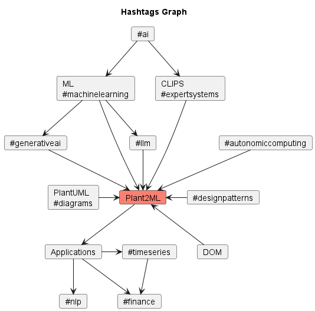

# Plant2ML Weekly Highlights

Weekly top #ai and #machinelearning paper highlights.
We ❤️ reading and discussing scientific papers, especially at the nexus of: #llm,
#expertsystems, #automl, #diagrammaticreasoning and #autonomiccomputing with applications in #timeseries and #nlp.

<!--
[Subscribe to our newsletter](https://nlpnews.substack.com/) to get a weekly list of top ML papers in your inbox.
-->
Here is the weekly series:

## 2024

- [Top References of the Week (March 4 - March 10)](./#top-references-of-the-week-march-4---march-10---2024)
- [Top References of the Week (February 26 - March 3)](./#top-references-of-the-week-february-26---march-3---2024)
- [Top References of the Week (February 19 - February 25)](./#top-references-of-the-week-february-19---february-25---2024)

[Follow us on Twitter](https://twitter.com/mobilepixel)

<!--
[Join our Discord](https://discord.gg/SKgkVT8BGJ)
-->

## Top References of the Week (March 4 - March 10) - 2024
| **Reference**                                                                                                                                                                                                            | **Hashtag**                | **Links**                                                                                                |
|--------------------------------------------------------------------------------------------------------------------------------------------------------------------------------------------------------------------------|----------------------------|----------------------------------------------------------------------------------------------------------|
| 1) **Transformers for Time-Series Data**                                                                                                                                                                                 | #timeseries #transformers | [Blog](https://medium.com/bearingpoint-data-analytics-ai/transformers-for-time-series-data-3fadff9f07d8) 
| 2) **Bentsen 2022** - Spatio-Temporal Wind Speed Forecasting using Graph Networks and Novel Transformer Architectures                                                                                                    | #timeseries #transformers | [Paper](https://arxiv.org/abs/2208.13585) [GitHub](https://github.com/LarsBentsen/FFTransformer.) 
| 3) **Bentsen 2023** - A Unified Graph Formulation for Spatio-Temporal Wind Forecasting                                                                                                                                   | #timeseries #transformers | [Paper](https://www.duo.uio.no/handle/10852/105903) 
| 4) **AutoML Time Series** - How to Forecast Time Series Data Using any Supervised Learning Model Featurizing time series data into a standard tabular format for classical ML models and improving accuracy using AutoML | #timeseries #automl | [Blog](https://towardsdatascience.com/how-to-forecast-time-series-data-using-any-supervised-learning-model-02dd62cd4bda) [GitHub](https://github.com/mturk24/blog_posts/blob/main/time_series_automl/time_series_automl.ipynb) [Kaggle](https://www.kaggle.com/datasets/robikscube/hourly-energy-consumption?select=PJME_hourly.csv)
| 5) **ReAct** - Using LangChain ReAct Agents for Answering Multi-hop Questions in RAG Systems. Useful when answering complex queries on internal documents in a step-by-step manner with ReAct and Open AI Tools agents. | #llm | [Blog](https://towardsdatascience.com/using-langchain-react-agents-for-answering-multi-hop-questions-in-rag-systems-893208c1847e)
| 6) **Yao 2023** - REACT: SYNERGIZING REASONING AND ACTING IN LANGUAGE MODELS | #llm | [Paper](https://arxiv.org/pdf/2210.03629.pdf) [GitHub](https://react-lm.github.io/) [Blog](https://blog.research.google/2022/11/react-synergizing-reasoning-and-acting.html)
| 7) **TradingGPT** - Discover TradingGPT: Multi-Agent System with Layered Memory and Distinct Characters | #finance #llm | [Blog](https://medium.com/@basics.machinelearning/discover-tradinggpt-multi-agent-system-with-layered-memory-and-distinct-characters-3070684812a8)
| 8) **Li 2023** - TradingGPT: Multi-Agent System with Layered Memory and Distinct Characters for Enhanced Financial Trading Performance | #finance #llm | [Paper](https://arxiv.org/pdf/2309.03736.pdf)

## Top References of the Week (February 26 - March 3) - 2024
| **Reference**                                                                                                                                                                                               | **Hashtag**          | **Links**                                                                                                                                                                                                             |
|-------------------------------------------------------------------------------------------------------------------------------------------------------------------------------------------------------------|----------------------|-----------------------------------------------------------------------------------------------------------------------------------------------------------------------------------------------------------------------|
| 1) **Diagramming AI** - Instantly Design and Edit UML & Workflows with AI Discover the power of Diagramming AI. Make complex UML structures and workflow designs simple and efficient.                      | #diagrams            | [Website](https://diagrammingai.com/) [Tweet](https://twitter.com/Diagrammin71888)                                                                                                                                    
| 2) **DSPy** - intro to DSPy: Goodbye Prompting, Hello Programming!                                                                                                                                          | #llm                 | [Blog](https://towardsdatascience.com/intro-to-dspy-goodbye-prompting-hello-programming-4ca1c6ce3eb9) [YouTube](https://www.youtube.com/watch?v=41EfOY0Ldkc)                                                          
| 3) **Khattab 2023** - DSPy: Compiling Declarative Language Model Calls into Self-Improving Pipelines                                                                                                        | #llm                 | [Paper](https://arxiv.org/abs/2310.03714) [GitHub](https://github.com/stanfordnlp/dspy)                                                                                                                               
| 4) **White 2023** - A Prompt Pattern Catalog to Enhance Prompt Engineering with ChatGPT                                                                                                                     | #llm #designpatterns | [Paper](https://arxiv.org/abs/2302.11382)                                                                                                                                                                             
| 5) **Generative AI Design Patterns:** - A Comprehensive Guide Reference architecture patterns and mental models for working with Large Language Models (LLM’s) Pattern 4) Blending Rules Based & Generative | #designpatterns      | [Blog](https://towardsdatascience.com/generative-ai-design-patterns-a-comprehensive-guide-41425a40d7d0#19ee)                                                                                                          | #llm #design-patterns | [Blog](https://towardsdatascience.com/generative-ai-design-patterns-a-comprehensive-guide-41425a40d7d0#19ee)                                                                                                                                                                                                              |
| 6) **Yacoub 1998** - A Pattern Language of Statecharts | #fsm #designpatterns | [Paper](https://citeseerx.ist.psu.edu/document?repid=rep1&type=pdf&doi=ef5c03e76a6dcaddd85c692695cdc309fc637924)                                                                                                                                                                                                         
| 7) **Gilson 2022** - How Well Does ChatGPT Do When Taking the Medical Licensing Exams? The Implications of Large Language Models for Medical Education and Knowledge Assessment                             | #llm #fsm            | [Paper](https://www.researchgate.net/publication/366606688_How_Well_Does_ChatGPT_Do_When_Taking_the_Medical_Licensing_Exams_The_Implications_of_Large_Language_Models_for_Medical_Education_and_Knowledge_Assessment) 
| 8) **Watsonx** - Approaches in Using Generative AI for Business Automation: The Path to Comprehensive Decision Automation                                                                                   | #llm #expertsystems  | [Blog](https://medium.com/@pierrefeillet/approaches-in-using-generative-ai-for-business-automation-the-path-to-comprehensive-decision-3dd91c57e38f)                                                                   
| 9) **Kephart 2003** - The vision of autonomic computing | #autonomiccomputing  | [Paper](https://ieeexplore-ieee-org.proxy.bib.uottawa.ca/document/1160055)
| 10) **Engati** - Autonomic computing | #autonomiccomputing  | [Website](https://www.engati.com/glossary/autonomic-computing)

## Top References of the Week (February 19 - February 25) - 2024
| **Reference**                                                                                                             | **Hashtag**          | **Links**                                                                                                                                                                                                             |
|---------------------------------------------------------------------------------------------------------------------------|----------------------|-----------------------------------------------------------------------------------------------------------------------------------------------------------------------------------------------------------------------|
| 1) **Kolovos 2020** - Picto - Efficient generation of graphical model views via lazy model-to-text transformation         | #diagrams | [Paper](https://dl.acm.org/doi/10.1145/3365438.3410943)
| 2) **Yohannis 2024** - Picto Web - Exploring complex models with picto web                                                | #diagrams | [Paper](https://www-sciencedirect-com.proxy.bib.uottawa.ca/science/article/pii/S0167642323001193) [GitHub](https://github.com/epsilonlabs/picto-web) [Videos](https://drive.google.com/drive/folders/1BCEKJhsEq50Yi7xFjx2Wpc6j-68Wtcxv)
| 3) **Jouault 2020** - AnimUML - Designing, animating, and verifying partial UML Models | #diagrams | [Paper](https://dl.acm.org/doi/10.1145/3365438.3410967) [Slides](https://animuml.kher.nl/slides/MODELS2020.html#1) [GitHub](https://github.com/ESEO-Tech/AnimUML)                                                                                                                        
| 4) **Jouault 2021** - AnimUML as a UML Modeling and Verification Teaching Tool                                            | #diagrams | [Paper](https://ieeexplore-ieee-org.proxy.bib.uottawa.ca/stamp/stamp.jsp?tp=&arnumber=9643629) [GitHub](https://github.com/fjouault/SampleVulnerableDriverModel) [Website](https://animuml.obpcdl.org/doc.html)
| 5) **Pasquier 2020** - AnimUML - Evaluating tool support for embedded operating system security: an experience feedback   | #diagrams | [Paper](https://dl.acm.org/doi/abs/10.1145/3417990.3420048)
| 6) **Pasquier 2022** - AnimUML - Practical Multiverse Debugging through User-defined Reductions Application to UML Models | #diagrams | [Paper](https://dl.acm.org/doi/pdf/10.1145/3550355.3552447)
| 7) **Jackson 1999** - CLIPS - Introduction To Expert Systems | #expertsystems | [Amazon](https://www.amazon.ca/dp/0201876868/)
| 8) **Riley 2022** - Adventures in Rule-Based Programming: A CLIPS Tutorial | #expertsystem | [Amazon](https://www.amazon.ca/Adventures-Rule-Based-Programming-CLIPS-Tutorial/dp/B09ZCL2VMM)
| 9) **Giarratano 2004** - CLIPS - Expert Systems: Principles and Programming | #expertsystem | [Amazon](https://www.amazon.ca/Expert-Systems-Programming-Joseph-Giarratano/dp/0534384471)
| 10) **Selic 2023** - Real-Time Object-Oriented Modeling | #fsm | [Amazon](https://www.amazon.ca/Real-Time-Object-Oriented-Modeling-Bran-Selic/dp/3911081014)